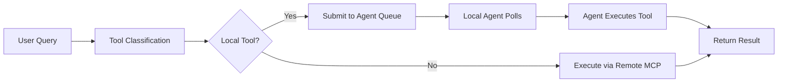

# Scintilla Local Agent System

## 🏠 **Overview**

Scintilla supports both **remote** and **local** tool execution through a unified interface. Local tools are executed by polling-based proxy agents on your local machine, while remote tools are executed via standard MCP servers.

## 🎯 **URL Scheme Pattern**

To use local execution, you **must** use one of these URL schemes when creating sources:

### **Supported Local Schemes**

| Scheme | Purpose | Example | Use Case |
|--------|---------|---------|----------|
| `local://` | Generic local tools | `local://file-search` | Custom local tools |
| `stdio://` | STDIO MCP servers | `stdio://path/to/server` | Local MCP executables |
| `agent://` | Agent capabilities | `agent://jira-search` | Proxy agent tools |

### **Examples**

```javascript
// ✅ LOCAL execution - will route to local agents
{
  "name": "Local File Search",
  "server_url": "local://file-search",
  "credentials": {...}
}

// ✅ LOCAL execution - STDIO MCP server
{
  "name": "Local Jira Tools", 
  "server_url": "stdio:///usr/local/bin/jira-mcp-server",
  "credentials": {...}
}

// ✅ LOCAL execution - Agent capability
{
  "name": "Local Confluence",
  "server_url": "agent://confluence-search", 
  "credentials": {...}
}

// ☁️ REMOTE execution - standard HTTP/HTTPS
{
  "name": "Remote API",
  "server_url": "https://api.example.com/mcp",
  "credentials": {...}
}
```

## 🤖 **Local Agent Architecture**

### **Components**

1. **Scintilla Server** - Manages task queue and agent registry
2. **Local Proxy Agents** - Poll for work and execute tools locally
3. **Task Coordination** - Routes tools to appropriate execution method

### **Flow**



## 🛠️ **Setting Up Local Agents**

### **1. Create Source with Local URL**

```bash
curl -X POST "http://localhost:8000/api/sources" \
  -H "Content-Type: application/json" \
  -d '{
    "name": "Local Jira Tools",
    "server_url": "local://jira-search",
    "description": "Local Jira integration",
    "credentials": {
      "auth_headers": {
        "x-api-key": "your-jira-token"
      }
    }
  }'
```

### **2. Register Local Agent**

```bash
curl -X POST "http://localhost:8000/api/agents/register" \
  -H "Content-Type: application/json" \
  -d '{
    "agent_id": "jira-agent-001",
    "name": "Jira Local Agent",
    "capabilities": ["jira_search", "jira_get_ticket", "jira_create_ticket"],
    "metadata": {
      "version": "1.0",
      "author": "local-admin"
    }
  }'
```

### **3. Agent Polling Loop**

```python
import asyncio
import aiohttp

async def agent_polling_loop():
    agent_id = "jira-agent-001"
    
    while True:
        # Poll for work
        async with aiohttp.ClientSession() as session:
            async with session.post(f"http://localhost:8000/api/agents/poll/{agent_id}") as response:
                data = await response.json()
                
                if data.get("has_work"):
                    task = data["task"]
                    task_id = task["task_id"]
                    tool_name = task["tool_name"]
                    arguments = task["arguments"]
                    
                    # Execute the tool locally
                    result = await execute_local_tool(tool_name, arguments)
                    
                    # Submit result
                    await session.post(f"http://localhost:8000/api/agents/results/{task_id}", json={
                        "task_id": task_id,
                        "agent_id": agent_id,
                        "success": True,
                        "result": result
                    })
                else:
                    # No work, wait before polling again
                    await asyncio.sleep(2)

async def execute_local_tool(tool_name: str, arguments: dict) -> str:
    """Execute tool locally and return result"""
    if tool_name == "jira_search":
        # Your local Jira search implementation
        return "Local Jira search results..."
    elif tool_name == "jira_get_ticket":
        # Your local ticket retrieval
        return "Local ticket details..."
    else:
        return f"Unknown tool: {tool_name}"

# Run the agent
asyncio.run(agent_polling_loop())
```

## 📊 **Monitoring Local Agents**

### **Check Agent Status**

```bash
curl "http://localhost:8000/api/agents/status"
```

**Response:**
```json
{
  "registered_agents": 2,
  "pending_tasks": 0,
  "active_tasks": 1,
  "agents": [
    {
      "agent_id": "jira-agent-001",
      "name": "Jira Local Agent",
      "capabilities": ["jira_search", "jira_get_ticket"],
      "active_tasks": 1,
      "last_seen": "2025-01-27T10:30:00Z"
    }
  ]
}
```

### **Test Direct Execution**

```bash
curl -X POST "http://localhost:8000/api/agents/execute" \
  -H "Content-Type: application/json" \
  -d '{
    "tool_name": "jira_search",
    "arguments": {"query": "test issue"},
    "timeout_seconds": 30
  }'
```

## 🔧 **Tool Classification Examples**

### **Automatic Classification**

```python
# When user creates source with local:// scheme
source = {
    "name": "My Local Tools",
    "server_url": "local://file-operations",  # 🏠 Will be LOCAL
    "credentials": {...}
}

# When user creates source with https:// scheme  
source = {
    "name": "Remote API", 
    "server_url": "https://api.hive.com/mcp",  # ☁️ Will be REMOTE
    "credentials": {...}
}
```

### **Query Processing**

```python
# User query: "Search files for 'config'"
# System detects tools from sources:
# - file_search (from local://file-operations) -> Routes to LOCAL agent
# - api_search (from https://api.com/mcp) -> Routes to REMOTE MCP

# Both execute in parallel, results combined
```

## 🚀 **Benefits**

### **For Users**
- **Explicit control** - You decide what runs locally vs remotely
- **Security** - Sensitive tools can run locally only
- **Performance** - Local tools avoid network latency
- **Flexibility** - Mix local and remote tools seamlessly

### **For Developers**
- **Clear patterns** - No guessing about execution location
- **Easy integration** - Standard polling API for local agents
- **Scalable** - Add more local agents as needed
- **Unified interface** - Same query API for all tools

## ⚠️ **Important Notes**

1. **URL Scheme is Required** - Local tools MUST use `local://`, `stdio://`, or `agent://` schemes
2. **Agent Registration** - Local agents must register and poll for work
3. **Capability Matching** - Agent capabilities must match tool names exactly
4. **Timeout Handling** - Local tools have configurable timeouts (default 60s)
5. **Error Handling** - Failed local tools fall back gracefully

## 🔍 **Troubleshooting**

### **Tool Not Executing Locally**

1. Check source URL scheme: `local://`, `stdio://`, or `agent://`
2. Verify agent is registered: `GET /api/agents/status`
3. Check agent capabilities match tool name
4. Verify agent is polling and responding

### **Agent Not Receiving Work**

1. Confirm agent polling endpoint: `POST /api/agents/poll/{agent_id}`
2. Check task queue: `GET /api/agents/status`
3. Verify agent capabilities match pending tasks
4. Check agent last seen timestamp

### **Debugging Tools**

```bash
# Test tool classification
curl "http://localhost:8000/api/sources" | jq '.[] | {name, server_url}'

# Monitor agent activity  
curl "http://localhost:8000/api/agents/status" | jq '.agents'

# Test direct tool execution
curl -X POST "http://localhost:8000/api/agents/execute" \
  -d '{"tool_name": "test_tool", "arguments": {}}'
```

This system provides a robust foundation for hybrid local/remote tool execution while maintaining a clean, explicit user interface. 